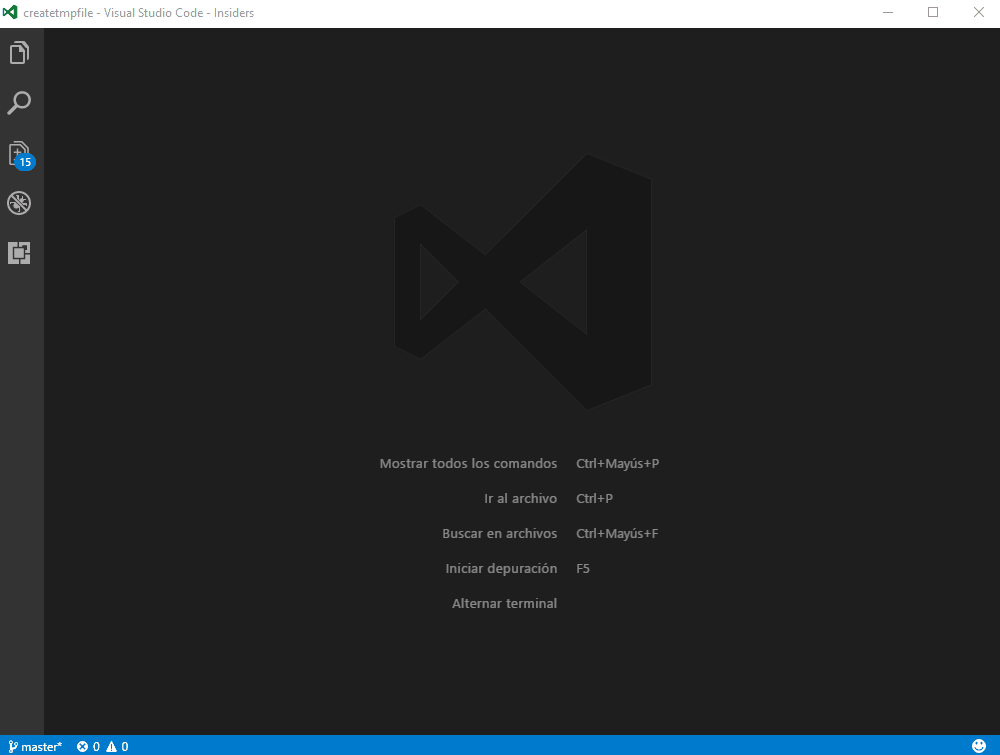

# createtmpfile

A really simple extension to create temporary files.

I use it with 'vscode-database' and/or 'code runner' extensions to test sample code.

## Features

## Requirements

## Extension Settings
This extension contributes the following settings:

* `createtmpfile.deleteOnExit`: removes the created files when vscode exits
* `createtmpfile.tmpDir`: where the temporary files will be created

## Known Issues

## Release Notes

### 0.0.1

Initial release

-----------------------------------------------------------------------------------------------------------
